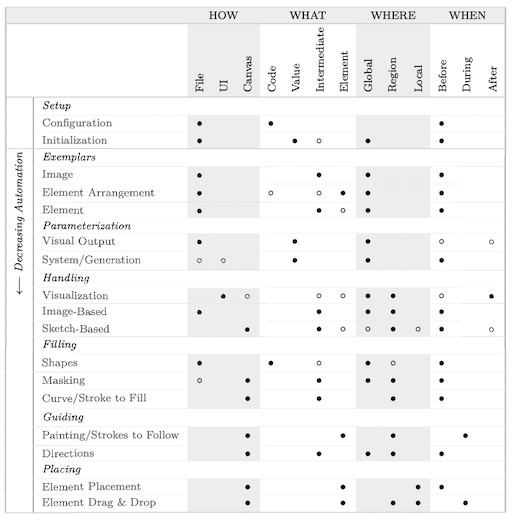
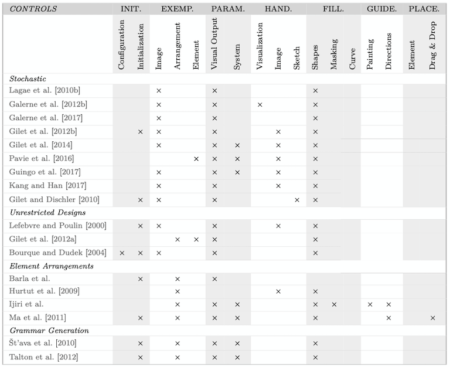
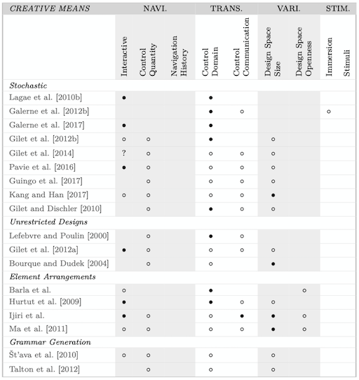
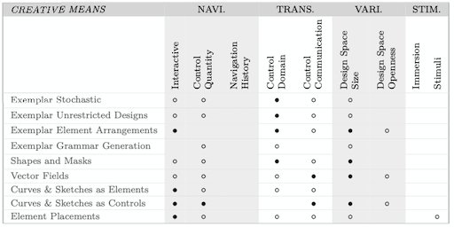

<!--  

---  
title: Deco Star Outline
author: Lena Gieseke
bibliography: deco_outline.bib
css: style.css
---   

-->

# Deco STAR

* [Deco STAR](#deco-star)
* [Title](#title)
* [Abstract](#abstract)
* [Contributions](#contributions)
* [Analysis Framework for Creative Control](#analysis-framework-for-creative-control)
    * [Terminology](#terminology)
    * [Taxonomy of Control Mechanisms](#taxonomy-of-control-mechanisms)
        * [Control Paradigms](#control-paradigms)
        * [Control Mechanisms](#control-mechanisms)
    * [Creative Means](#creative-means)
* [State of the Art of Creative Control for Pattern Generation](#state-of-the-art-of-creative-control-for-pattern-generation)
    * [Design Goals](#design-goals)
    * [Models](#models)
    * [Terminology](#terminology-1)
    * [Analysis of the State of the Art](#analysis-of-the-state-of-the-art)
        * [Example-Based Methods and Inverse Control](#example-based-methods-and-inverse-control)
        * [Shapes and Masks](#shapes-and-masks)
        * [Vector Fields](#vector-fields)
        * [Curves, Sketches and Painting](#curves-sketches-and-painting)
        * [Element Placement](#element-placement)
        * [Machine Learning](#machine-learning)
        * [Semantic Attributes](#semantic-attributes)
        * [Summary](#summary)
* [Questions](#questions)

<!-- - - - - - - - - - - - - - - - - - - - - - - - - - - - - - - - - - - - - - - - - - - - - - - - - - - - - -->
Title
==================

WIP: Creative Control for (Procedural) Pattern Generation
<!-- - - - - - - - - - - - - - - - - - - - - - - - - - - - - - - - - - - - - - - - - - - - - - - - - - - - - -->

<!-- - - - - - - - - - - - - - - - - - - - - - - - - - - - - - - - - - - - - - - - - - - - - - - - - - - - - -->
Abstract
==================

TODO: next

For coming up with the abstract you can follow these questions by Kent Beck:

* State the problem
    * Who is suffering the problem?
    * Connect with your target audience
* Why is it a problem and why is it interesting?
    * Your solution and achievements
* What achieves your solution
    * Say something catchy
    * Should be falsifiable
* What follows from your solution
    * Where or how to use
    * Implications for society, community, other researchers, …

A good example:

> The rejection rate for OOPSLA papers is near 90%. Most papers are rejected not because of a lack of good ideas, but because they are poorly structured. Following four simple steps in writing a paper will dramatically increase your chances of acceptance. If everyone followed these steps, the amount of communication in the object community would increase, improving the rate of progress.

<!-- - - - - - - - - - - - - - - - - - - - - - - - - - - - - - - - - - - - - - - - - - - - - - - - - - - - - -->

<!-- - - - - - - - - - - - - - - - - - - - - - - - - - - - - - - - - - - - - - - - - - - - - - - - - - - - - -->
Contributions
==================

1. A Framework for the Analysis of Creative Control 

The STAR presents an interlinking analysis of creation methodologies and a generally applicable taxonomy for control mechanisms, ranging from automatic to manual control. The connection of a specific mechanism to its capabilities in a creative process are analyzed. The presented taxonomy allows for an evaluation of creativity support with a well-defined framework, which complements the common approach of user surveys.  

2. Analysis of the State of the Art in regard to Creative Control for Pattern Generation

As exemplary design goal for a meaningful application of the analysis framework to the state of the art, pattern generation is established. Due to nature of patterns as design goal the analysis contributes, next to discussing procedural representations, with bridging between procedural and data-driven solutions and joint classification results. 
<!-- - - - - - - - - - - - - - - - - - - - - - - - - - - - - - - - - - - - - - - - - - - - - - - - - - - - - -->

<!-- - - - - - - - - - - - - - - - - - - - - - - - - - - - - - - - - - - - - - - - - - - - - - - - - - - - - -->

Analysis Framework for Creative Control
==================

Questions – What is needed as theoretical basis for an evaluation of creative control mechanisms? More precisely, what are relevant characteristics of a creation process with digital tools? What are specific control mechanisms, ranging from global to local and from automatic to manual, with varying levels of abstraction for their handling? How do these mechanisms relate to the stages of a creation process? What are the requirements for creative creation, and how can these be customized to the context of digital creation tools?

Contributions

* The introduction of control paradigms for creation processes with digital tools.
* The identification and classification of common interaction mechanisms according to control paradigms.
* The analysis of methods for creative control and the description of determining properties for it. The translation of interaction mechanisms to these creative means.

## Terminology

Artistic, Canvas, Shape, Curve/Line/Stroke, User Interface (UI), Interactive, Design space, Expressiveness, Goal-oriented control

## Taxonomy of Control Mechanisms

We dissect a creation process into overall control paradigms and classify specific control mechanisms by their interaction types. The taxonomy shows the capabilities of the different control mechanisms and potential trade-offs between approaches.  

### Control Paradigms

A creation process can be fully described by answering the questions of how, what, where, when and who. These paradigms are valid for various creation contexts and could even be translated to traditional media such as aquarell on paper.

* How is a control executed or an input given by an artist? How far is it from the visual result on the canvas?
    * File, Ui, On canvas
* What does an artist give as input? What is the level of abstraction of the content
that an artist works with?
    * Code, Value, Intermediate, Element
* Where does the input have an effect spatially and what is its area of influence?
    * Global, Region, Local
* When can input be given and at what time in the creation process is the control
executed?
    * Before, During, After
* Who can give the input in regard to the type of skill set needed? (will not be discussed in detail)
    * Programmer, Artist

### Control Mechanisms

For a meaningful analysis, the above classification must be further broken down into the specific control mechanisms.  

The following low-level characteristics categorize input modes and their primary effect. Because this survey focuses on interfacing algorithms, UI specifics, such as the layout of buttons, are not considered. Once the specific control mechanisms are analyzed, they constitute a method in combination with the above control paradigms.  

* Setup
    * System Configuration,Task Initialization
* Exemplars
    * Image, Element Arrangement, Element
* Parameterization
    * Visual Output, System/Generation
* Handling
    * Visualization, Image-Based, Sketch-Based
* Filling
    * Shapes, Masking, Curve/Line/Stroke to Fill
* Guiding
    * Painting/Strokes to Follow, Directions
* Placing
    * Element Placement, Element Drag & Drop

For interrelating the control mechanisms to the control paradigms, we considered the publications that are investigated in the State of the Art of Creative Control for Pattern Generation. Due to the diversity of the underlying methods and the different design goals of the considered body of work, we believe this to be a representative summarization. 

  
*[Table 2.1] Control mechanisms classified by their average usage: In total, 40 publications are included (the discussed state of the art work of Chapter 3). A classification is weak if between 25 50 % of the work in that class include the usage scenario and is strong if it is above 50 %.*

QUESTION: Is the table really meaningful? If not how could the control mechanisms be connected to the control paradigms?

Table 2.1 shows that global, hence automatic, control is usually enabled through intermediated representations, such as an example image, while on the other end of the spectrum, the placement of elements as part of the actual output is local, and automation is lost.  

Parameterization and the different types of handling also require abstracted input from an artist, such as the use of a slider. Sketch-based controls, such as an eraser, move the interaction onto the canvas and can make small-scale adjustments. The definition of a space or a curve to fill and masking areas is also usually done directly on the canvas but only influence the output indirectly.  

A painting mechanism simultaneously creates the output directly on the canvas but can only do so in a limited region depending on the brush size. All other inputs are typically given before or after the generation of the output.  

This classification underlines that a focus on one control type, as is usual in computer graphics research, leads to the common trade-off between global automation and local manual manufacturing. <!-- In order to support creative work, control mechanisms need to be combined in a novel and unified manner. -->

## Creative Means

[...]

For handling the ill-defined topic of creativity, we follow the definition of creativity as intentionally producing a novel and surprising product. 

Hence, we understand a creative tasks as intentionally producing – for oneself – a novel and surprising product.

[...]

For control mechanisms to support a creative task, they should offer variation, the chance of steerable exploration and meaningful stimuli, according to the domain a given mechanism serves. For these characteristics, there is no clear translation into quantifiable metrics, such as timings or error rates, which are standardized measurements for productivity [Cherry and Latulipe 2014; Shneiderman 2007].

For this analysis framework, we understand variation as the size of the design space within the context of the technique. For the exploration of different designs we distinguish between the general controllability necessary for navigating a design space (“there are many different roads in the landscape”), and the transparency of that navigation and the understanding of cause and effect when using the tool (“I have the map to the landscape and know how to get from one point to another”). Lastly we investigate the stimuli of a method and its suggestive capabilities. All categories can be seen as somewhat loose and experimental and aiming toward a better understanding of requirements for creative controls.

* Navigation
    * The means of navigation describe whether a creation processes is efficiently manageable as well the extent of the controllability.
    * Interactive, Quantity of Controls, Navigation History
* Transparency
    * The means of transparency describe how clear the understanding of cause and effect within the system are.
    * Control Domain, Control Communication
* Variation
    * The means of variation indicate how visually different the results can be.
    * Size of the Design Space, Openness of the Design Space
* Stimulation
    * The means of stimulation indicate how well an artist can enter a pleasurable and stimulating workflow.
    * Immersion, Stimuli
  

With the above list, we establish means for creative control and discuss how to relate specific control mechanisms to creative processes (QUESTION: Do we do that here already properly?). By this we further a more objective judging of the ability of a technique to support creativity and a detailed comparison of methods.  

<!-- However, some aspects of the analysis framework still leave room for interpretation. Knowledge from other disciplines, for example in regard to the perception of visual features, might be able to contribute with valuable insights. We hope that our results inspire such research towards a quantifiable analysis of creative control. -->

<!-- - - - - - - - - - - - - - - - - - - - - - - - - - - - - - - - - - - - - - - - - - - - - - - - - - - - - -->
State of the Art of Creative Control for Pattern Generation
==================

Questions – Which control mechanisms are available in the state of art for (procedural), two-dimensional pattern generation? How do current research results support, and what potential do they have for creative creation?

Contribution

* The identification, summary and classification of related work from various fields of research. The evaluation of the work in regard to its means and potential for creative control for ornamentation.

## Design Goals

*[Description of pattern designs we consider.]*

QUESTION: Ornamentation constitutes a challenging, multi-layered design goal, which requires to be creative. But ornamentation is as topic too narrow, I would say. I would open up the scope to aesthetically pleasing pattern, where ornamentation is specialized sub-goal of. With pattern generation, enabling creativity might be less important factor though.

## Models

In the context of computer graphics, generation techniques are differentiated into procedural and data-driven approaches.

A data-driven approach is discussed, and models specifically developed for ornamental designs are summarized.

* Procedural
    * Ebert et al. [2002] describe procedural techniques as algorithms and mathematical functions that synthesize a model or an effect. [...]
    * We further categorizes procedural models as stochastic, function and rule based, grammar based, simulation based, and artificial intelligence based. 
* Data-Driven 
    * Data-driven methods can be used in two ways in the context of pattern generation. First, they describe the processing of input pixel data, such as a photograph. Second, they refer to the output of a method, which is again pixel data. [...]
    * Data-driven models are numerous and diverse because they can use and produce any input and output data without an underlying procedural model. Their classification is out of scope of this work (QUESTION: Does this still apply?). However, we do include in the following various techniques that offer further meaningful control mechanisms in the context of pattern generation. These techniques include the tiling and distribution of elements and drawing and brush mechanisms.

<!-- For a review of models that output ornamental patterns, we focus on the output of the models and not on their underlying generation principles in order to come to a summarization. -->

## Terminology

Pattern, Texture, Decor, Ornament, Creative, Procedural, Data-driven, Parameterized

## Analysis of the State of the Art

In this section, we execute the above established analysis framework in regard to creative control for pattern generation. 

It is important to note that in the following, we do not analyze the specific aesthetic value of an ornament except with regard to its coherence with the defining design principles. 

NOTE: The following categories for the subsections are up to discussion.

### Example-Based Methods and Inverse Control

Example-based approaches compute a separate output based on a given example and provide a goal-oriented control. The motivation behind using these techniques is mainly to generate a specific and predictable output as efficiently as possible.

*[literature review]*

  
*[Table 3.1] Interaction means for example-based techniques.*

QUESTION: How to substitute the following strong-weak classifications while still making a conntection to the creative means?

  
*[Table 3.2] Creative means for example-based techniques.*

### Shapes and Masks

The most basic control requirement is to define an area to be filled. Methods that focus on the development of novel underlying procedural systems with no acknowledgment of control mechanisms, also need to define the space to fill and a relationship of the system to that space. Many approaches take the idea of simply outlining a space further and carefully design growth constraints, offer masking and the sketching of areas to be filled, thus leading to complex designs.

*[literature review]*
*[tables]*

### Vector Fields

Fields constitute a powerful tool for combining an automatic procedural filling by individually designing regions on the canvas. In the context of two-dimensional pattern generation, these fields are usually vector fields. The streamlines of a field can create curves as part of the pattern that fill and structure a space. The design of a vector field requires less manual work than the manual creation of curves. Other global design choices, such as an overall growth direction or the alignment of elements, are simple to translate from a vector field to procedural generation rules.

*[literature review]*
*[tables]*

### Curves, Sketches and Painting

Curves and hand-drawn paths give an artist more direct control than the previously discussed methods to fill a space. In addition to the visual output being further constrained, the control is put onto the actual canvas. Curves are needed for tasks such as creating an frame or structuring the space. Some techniques consider the whole curve before computing the pattern, optimizing the filling of the curve based on certain design goals, enabling a form of global planning.

Painting-tool-like methods create output along curves but do so directly without taking an a priori completed curve into consideration, as if using a spray can or a brush. Painting techniques usually include a brush diameter, hence the size of the area to be filled along the curve.

*[literature review]*
*[tables]*

### Element Placement

The placement of single elements onto the canvas maximizes artist control and is on its own a rather trivial data-driven control principle. However, in combination with procedural modeling, this mechanism becomes interesting. Separately placed elements that do not follow any rules should be integrated and processed to ideally remain part of the underlying global scene structure. Even though this functionality can be compared to using the tip of a brush, paint-like procedural modeling techniques often have a more spray-can-like quality [Měch and Miller 2012] and do not include this option.

*[literature review]*
*[tables]*

### Machine Learning

To integrate a machine learning framework into a procedural system is a fairly novel development. QUESTION: In the context of pattern generation, does a summarization of the state of the art make sense here?

*[literature review]*
*[tables]*

### Semantic Attributes

The usage of semantic attributes presents a highly intuitive navigation technique, which so far has been successfully applied in the context of shape modifications, for example Yumer et al. [2015].  

*[literature review]*
*[tables]*

<!-- In the context of pattern generation, procedural textures constitute the most related field of investigation. For the control of procedural textures, methods are based on the analysis and description of texture in regard to human perception, which has a long research tradition. In his influential work, Julesz [1981] defines textons as the basic units of pre-attentive human texture perception. Since then, this line of research has continued, and texture descriptions with perceptual [Liu et al. 2015] and semantic [Matthews et al. 2013; Cimpoi et al. 2014] attributes have been investigated. Dong et al. [2017] and Liu et al. [2018] employed such features in first experiments for the navigation of a procedural texture space and for the generation of suitable textures by given features. However, the results of such studies are still limited and of varying quality – and the authors themselves [Liu et al. 2018] call their results experimental.  -->

### Summary

QUESTION: Again, how to get away from the strong-weak measurements?

The summary of all control mechanism groups in Table 3.7 shows that there is no approach that fulfils all creative means at least weakly:

  
*[Table 3.7] Summary of the creative means interpretations for the discussed control mechanisms. Strong characteristics (black circle) in the previously presented analyses of the specific techniques are counted as double and weak, as (white circle) single. Averages of 25-50% are considered as weak and above 50%, as strongly pronounced.*

<!-- - - - - - - - - - - - - - - - - - - - - - - - - - - - - - - - - - - - - - - - - - - - - - - - - - - - - -->

<!-- - - - - - - - - - - - - - - - - - - - - - - - - - - - - - - - - - - - - - - - - - - - - - - - - - - - - -->
Questions
==================

* Should we focus on procedural techniques (with which definition of procedural)?
* Should we focus on ornamental/aesthetically pleasing/etc. patterns?
* How can we leave out the strong and weak categories?
<!-- - - - - - - - - - - - - - - - - - - - - - - - - - - - - - - - - - - - - - - - - - - - - - - - - - - - - -->
